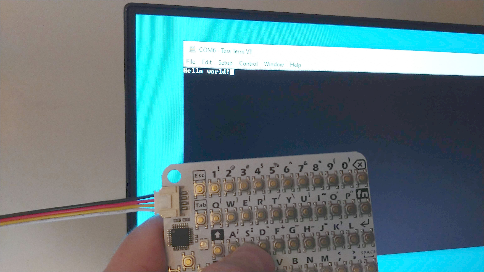

# Using A CardKB Keyboard With A UART

The CardKB is a simple credit card sized keyboard available from M5Stack, and from other stores like AliExpress or BangGood.

https://m5stack.com/products/cardkb-mini-keyboard

It connects to your project via an I2C interface, but sometimes it would be more convenient if it connected to a UART.
The keyboard has a connector on it for use with the "Grove System", which gives you an easy way to connect the different
modules in your project. Information can be found here:

https://wiki.seeedstudio.com/Grove_System/

The original Arduino sketch for the firmware has been modified to convert the keyboard from "Grove I2C" to "Grove UART" with a baud rate of 115,200. 
The signals on the cable are now:

* Black - Ground
* Red - VCC 3.3V/5V
* Yellow - TX data
* White - RX data (not currently used)

# Programming

The board is programmed using the Arduino IDE and a programmer that supports the Atmel ATMEGA328P. I chose the USBASP programmer.
The programming connector has this pinout:

I used these board settings:

The sketch is written to the board using the "Sketch --> Upload Using Programmer" menu.

This board uses the internal oscillator. It is important that you do not accidentally choose an external oscillator, or else you won't
be able to program it again unless you actually attach an external oscillator to the board. I found this out the hard way.
I now have two dead keyboards. It's a good thing I bought three when I placed my order.

# Connecting To Your Computer

For easy testing, just connect this keyboard to your computer with the use of a USB-to-UART adapter, A.K.A. an FTDI board.
Start up a terminal program like TeraTerm, choose the correct COM port, and make sure the baud rate is set to 115,200.

